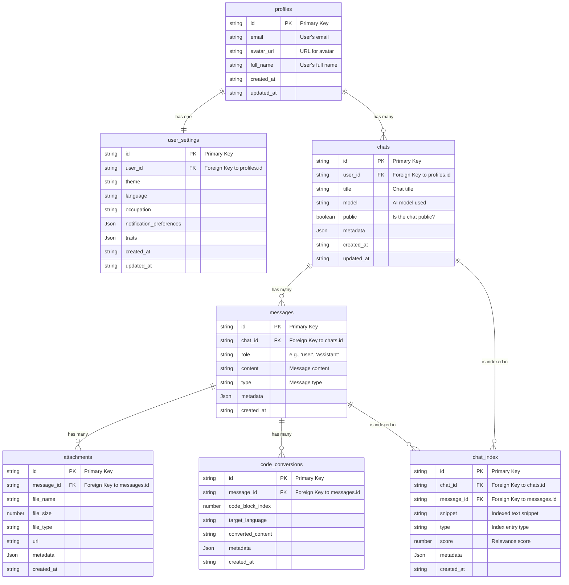

# T3 Clone: My Entry for the T3 ChatCloneathon

## Yet Another AI Chat App

The brief was "build a cool AI chat app." I may have taken that a bit too seriously.

This isn't just a T3 Chat clone -- it's a fully-featured, customizable AI chat platform built for power users, keyboard warriors, and anyone who's ever wished their LLM app had dark mode, 70+ model options, and a sense of humor.

Key features include:

- Multi-provider LLM support via Vercel AI SDK
- Full Supabase Auth with RLS and synced history
- One-click Vercel deploy with BYOK support
- Attachment uploads, syntax highlighting, hotkeys, chat branching, and more
- 51 hand-crafted UI themes and support for 259 languages

Yeah. It's a bit much. You're welcome.

---

## Tech Stack

- **Framework:** [Next.js](https://nextjs.org/) 14 (App Router)
- **AI SDK:** [Vercel AI SDK](https://sdk.vercel.ai/)
- **Database & Auth:** [Supabase](https://supabase.io/)
- **Styling:** [Tailwind CSS](https://tailwindcss.com/)
- **UI:** [React](https://react.dev/), [Lucide Icons](https://lucide.dev/)
- **Deployment:** [Vercel](https://vercel.com/)

---

## Getting Started: Local Setup

Follow these steps to get a local copy up and running. Or just click the demo link. Your call.

### 1. Prerequisites

- [Node.js](https://nodejs.org/en) (v18.x or later)
- [npm](https://www.npmjs.com/) or your preferred package manager
- A [Supabase](https://supabase.com/) account (The free tier is surprisingly generous)
- API keys for any AI providers you wish to use.

### 2. Clone the Repository

```bash
git clone https://github.com/monster0506/t3chatclone.git
cd t3-clone
```

### 3. Install Dependencies

```bash
npm install
```

### 4. Set Up Supabase

1. Go to your [Supabase Dashboard](https://app.supabase.com/) and click **"New project"**.
2. Once the project is created, navigate to the **SQL Editor**.
3. Copy the entire contents of `/schema.sql` and run it. This will build the digital scaffolding for your app.
4. Navigate to **Project Settings > API** to find the keys for the next step.

### 5. Configure Environment Variables

Create a file named `.env.local` in the root of your project. You only need to provide API keys for the services you intend to use. No need to fund every AI company on the planet just to run this locally.

```env
# .env.local

# --- Supabase Project Credentials (Required) ---
NEXT_PUBLIC_SUPABASE_URL=https://your-project-ref.supabase.co
NEXT_PUBLIC_SUPABASE_ANON_KEY=your_supabase_anon_key
SUPABASE_SERVICE_ROLE_KEY=your_supabase_service_role_key # KEEP THIS SECRET, unless you enjoy explaining security breaches.

# --- AI Provider API Keys (Add what you need) ---
# The Vercel AI SDK will automatically pick these up.
GOOGLE_GENERATIVE_AI_API_KEY=
OPENAI_API_KEY=
ANTHROPIC_API_KEY=
MISTRAL_API_KEY=
XAI_API_KEY=
DEEPSEEK_API_KEY=
CEREBRAS_API_KEY=
```

### 6. Run the Development Server

```bash
npm run dev
```

Open [http://localhost:3000](http://localhost:3000) and witness your creation come to life.

---

## Database Schema Overview

Behold, the blueprint. The full schema is in `/schema.sql`, but here's what each table does.


---

## Deploy on Vercel

The easiest way to deploy is to use the [Vercel Platform](https://vercel.com/new). Just remember to set your environment variables in the project settings.

---

## Features at a Glance

| Feature                     | Description                                                           |
| --------------------------- | --------------------------------------------------------------------- |
| **LLM Switching**           | Over 70 models supported across 7 providers                           |
| **Authentication**          | Supabase Auth with full row-level security                            |
| **UI Themes**               | 51 hand-crafted options, including _Synthwave Sunset_                 |
| **Attachments**             | PDF and image uploads, stored in Supabase and analyzable by AI        |
| **Syntax Highlighting**     | 259 languages. If you find a missing one, I will be impressed         |
| **Hotkeys**                 | Full keyboard navigation suite. Ctrl+? shows the full list            |
| **Web Search**              | Wikipedia integration with clean previews                             |
| **Autocomplete**            | Mind-reading autocomplete as you type                                 |
| **Chat Indexing**           | AI-generated summaries and jump points for long chats                 |
| **Chat Branching**          | Clone any conversation to fork your own rabbit holes                  |
| **Personalization**         | Set custom name, profession, personality, and persistent instructions |
| **Polyglot Code Converter** | Translate code between 295+ languages, because why not?               |

---

## Competition Rules Compliance

- **Open Source:** This project is licensed under the MIT License. Go nuts.
- **Team Size:** Solo dev: [monster0506](https://github.com/monster0506). Still on speaking terms with myself.
- **Content Usage:** I acknowledge that Theo may use this submission for content. Please make my code look good on camera.

---

## License

This project is licensed under the MIT License. See the `LICENSE` file for details.

---

## Built With Code and Vibes

Thanks for reading. Now go [try it out](https://t3clone.monster0506.dev), break stuff, and if you like what you see, [judge the code](https://github.com/monster0506/t3chatclone).

Built for the T3 ChatCloneathon with maximum scope creep.
